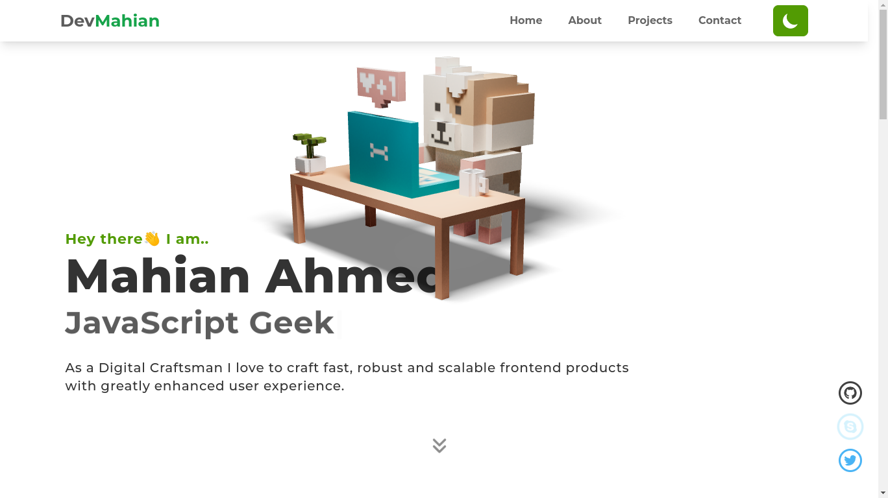

<!-- PROJECT LOGO -->

  <h1 align="center">Portfolio of Mahian Ahmed</h1>

  

    Get to know the latest trends of Cryptocurrencies around the Globe. Visualize entire growth of different CryptoCoins through Graphs.
     
     
    <a href="https://cryptoversereact.vercel.app/">View the Product live</a>
  

<!-- ABOUT THE PROJECT -->

## A Glimpse on the Project

## Built With

This project was built with many tools. Here are a few of them to mention:

- [React.js](https://reactjs.org/)
- [TypeScript](https://www.typescriptlang.org/)
- [React Three Fiber](https://github.com/pmndrs/react-three-fiber)
- [React Typing Effect](https://github.com/lamyfarai/react-typing-effect#readme)
- [React Icons](https://react-icons.github.io/react-icons)
- [Keen Slider](https://keen-slider.io/)
- [Vite](https://vitejs.dev/)

<!-- CONTACT -->

## Contact

Mahian Ahmed - [Connect@Twitter](https://twitter.com/DeveloperMahian)

Email - devmahiancontact@gmail.com

(<a href="#top">back to top</a>)

